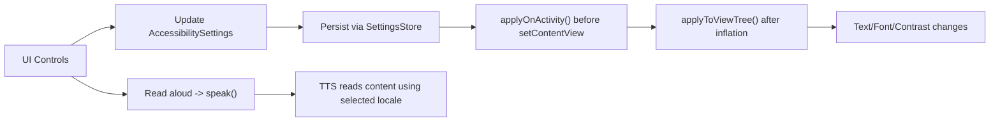

# Architecture (Engineering)

This project demonstrates an “SDK-like” approach to accessibility: a reusable toolkit module (`:toolkit`) plus a small demo app (`:demo`) that consumes the toolkit.

## Module responsibilities
- `:toolkit` (library)
  - Persists accessibility preferences (`SettingsStore`)
  - Applies theme before view inflation (`applyOnActivity`)
  - Applies locale by wrapping base context (`wrapBaseContext` used from `attachBaseContext`)
  - Applies settings to an already-inflated view tree (text scale, font style, high-contrast colors)
  - Exposes a minimal facade API (`AccessibilityToolkit`) and a small TTS wrapper
- `:demo` (app)
  - Provides UI controls (text size, high contrast, font, language)
  - Demonstrates the toolkit by re-applying settings live and using `recreate()` when required
  - Includes a bonus second screen to show reuse across Activities

## Data flow (high level)

## Why a facade?
The demo and app code call only `AccessibilityToolkit.*` methods. This keeps UI wiring clean and ensures the toolkit can evolve without forcing changes to every screen.

